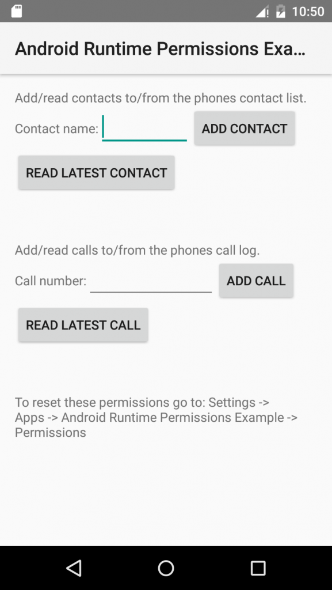
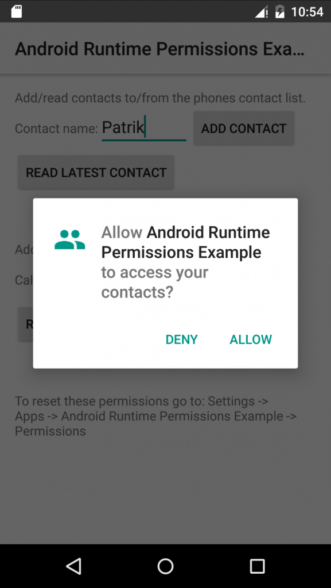
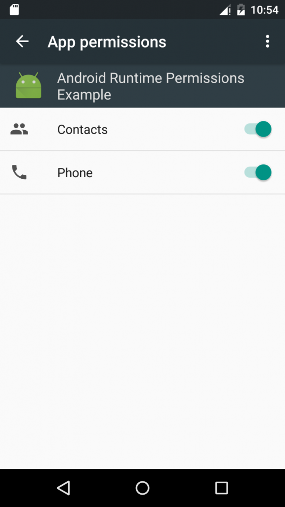

# android-runtime-permissions-example

Nu när Google I/O är över och vi har hunnit smälta att Google Photos vet allt om våra liv så tänkte jag ta tillfället i akt att lära mig lite om de nya funktionerna i Android M och det bästa sättet jag vet är att dyka ner i koden och försöka skapa något enkelt. Bland alla nyheter i Android M så har jag valt att utforska närmare en stor nyhet som kallas för App Permissions.


## App Permissions
I tidigare versioner av Android fick användaren alltid upp en fråga vid installation om man godkände alla behörigheter som appen ville komma åt. I Android M kan appen istället visa en dialog som begär tillgång till en specifik behörighet när det behövs. Detta gör att användaren kan välja helt på eget bevåg vilka behörigheter appen ska få tillgång till. Detta har funnits i iOS sedan länge och det är på tiden att Android kommer ikapp.

## Exempel
Jag kommer visa hur man använder det nya behörighetssystemet genom att bygga en enkel app med följande fyra enkla funktioner:

* Skapa en ny kontakt
* Läs senaste kontakten och visa namnet
* Skapa en post i telefonloggen
* Läs senaste posten i telefonloggen och visa telefonnumret



Dessa funktioner kräver olika behörigheter, var och en kommer att visa en dialog som ber om tillåtelse. Det trodde iallafall jag när jag började kolla på App Permissions men det visade sig att så är inte fallet. Google har passat på att förenkla behörigheterna och delat in dem i olika grupper.

I vårt exempel så tillhör ‘skapa kontakt’ och ‘läs kontakter’ samma grupp. Detta gör att om vi ber om tillåtelse för en av dom så kommer vi få tillgång till alla behörigher som är deklarerade i <i>AndroidManifest.xml </i>under samma grupp. Jag går in lite djupare på Manifesten senare.


## Android Studio
För att kunna köra Android M behöver man ladda hem senaste Android Studio (1.3 Preview), Android M SDK (MNC) med tillhörande emulatorer och Build/Platform Tools (23.0.0 rc1). Beskrivning finns <a href="http://developer.android.com/preview/setup-sdk.html" target="_blank">här</a>.

När utvecklingsmiljön är uppsatt kan du importera Gradle-projektet som du kan hämta från Gitlab:

´git clone https://github.com/stromvap/android-runtime-permissions-example.git`

## Gradle
För att Gradle ska kunna bygga Android M behöver man göra nedanstående konfigurationer i build.gradle filerna.

&nbsp;

```
buildscript {
    dependencies {
        ...
        classpath 'com.android.tools.build:gradle:1.3.0-beta1'
    }
}

...

android {
    compileSdkVersion 'android-MNC'
    buildToolsVersion "23.0.0 rc1"

    defaultConfig {
        minSdkVersion 'MNC'
        targetSdkVersion 'MNC'
        ...
    }
    ...
}
...
```

## Manifest
I *AndroidManifest.xml* deklarerar man vilka behörigheter appen vill få tillgång till:

```
<manifest>
    <!-- Group: android.permission-group.CONTACTS -->
    <uses-permission android:name="android.permission.READ_CONTACTS"/>
    <uses-permission android:name="android.permission.WRITE_CONTACTS"/>

    <!-- Group: android.permission-group.PHONE -->
    <uses-permission android:name="android.permission.READ_CALL_LOG"/>
    <uses-permission android:name="android.permission.WRITE_CALL_LOG"/>
    ...
</manifest>
```

Som ni ser så är det ingen skillnad på deklarationen mot tidigare SDK:er och ‘grupperna’ är bara logiska grupper. Om appen får tillgång till en behörighet kommer man automatiskt få tillgång till alla behörigheter i samma grupp som är deklarerade i Manifesten. Mer information om de olika grupperna och hur behörigheter funkar i symbios med tidigare version av Android kan ni läsa om <a href="http://developer.android.com/preview/features/runtime-permissions.html#coding" target="_blank">här</a>.

Behörigheter har även olika skyddsnivåer (normal, dangerous, signature, signatureOrSystem). Alla behörigheter som faller inom ‘normal’ och som är deklarerade i <em>AndroidManifest.xml</em> kommer appen automatiskt få tillgång till utan användarens medverkan. Detta för att bevara användaren från att behöva ge tillgång till t.ex. internet och alarmfunktioner för varje app. De olika skyddsnivåerna kan man läsa mer om <a href="http://developer.android.com/guide/topics/manifest/permission-element.html" target="_blank">här</a>.

## Behörigheter
Det första man ska göra när en användare vill komma åt en funktion som kräver en specifik behörighet är att kolla om appen redan har tillåtelse till denna:

```
if (checkSelfPermission(Manifest.permission.WRITE_CONTACTS) == PackageManager.PERMISSION_GRANTED) {
    // You have permission
} else {
    // You do not have permission
}
```

(Alla anrop görs på en *Activity*)

Om appen har tillgång så kan man anropa API:et för att utföra funktionen. Om appen inte har tillgång så måste man be om tillåtelse:

`requestPermissions(new String[]{Manifest.permission.WRITE_CONTACTS}, REQUEST_CODE_CONTACT);`

Nu visas en dialog som användaren väljer att godkänna eller neka.



Svaret hanteras i en callback som implementeras i vår *Activity*:

```
@Override
public void onRequestPermissionsResult(int requestCode, @NonNull String[] permissions, @NonNull int[] grantResults) {
    
    // We know that the array only contain one result since we only request one permission
    boolean granted = grantResults[0] == PackageManager.PERMISSION_GRANTED;

    if (granted &amp;&amp; REQUEST_CODE_CONTACT == requestCode) {
        // Permission granted
    }

    super.onRequestPermissionsResult(requestCode, permissions, grantResults);
}
```

Förfrågan och resultatet binds ihop med en *requestCode (int)* som på så många andra ställen i Android.

## Hantering av flöde
Nu har vi gått igenom de grundläggande funktionerna för att kolla behörighet, fråga efter behörighet och få svar om efterfrågad behörighet. Men hur ska man bygga sin app? Google har kommit fram med en del riktlinjer som man borde följa:

* Fråga endast efter behörighet när du behöver använda funktionen<
* Överös inte användaren med förfrågningar på en gång
* Förklara varför du behöver behörigheten
* Hantera nekade förfrågningar på ett bra sätt

Ytterligare en sak att tänka på är att användaren kan gå in i <em>Settings</em> -&gt; <em>Apps</em> -&gt; <em>App-name</em> -&gt; <em>Permissions</em> och stänga av behörighetsgrupper. Därför är det extra viktigt att alltid kolla om man har behörighet oavsett om appen har fått tillåtelse tidigare eller inte.



## Sammafattning
Även om det betyder mer jobb för oss utvecklare med mer felhantering och generell hantering av behörigheter så är det ändå ett väldigt välkommet tillägg, iallafall om man ska döma nyheterna efter hur mycket applåder de mottogs av då endast nyheten att Google Photos kommer få obegränsat utrymme tog emot fler applåder än App Permissions.

På återseende.

## Länkar<
<a href="http://developer.android.com/preview/setup-sdk.html" target="_blank">Setup SDK</a>

<a href="http://developer.android.com/preview/api-overview.html" target="_blank">API Overview</a>
<a href="http://developer.android.com/preview/features/runtime-permissions.html" target="_blank">Runtime Permissions</a>

<a href="https://www.youtube.com/watch?v=7V-fIGMDsmE" target="_blank">Google I/O 2015 Keynote</a>
<a href="https://www.youtube.com/watch?v=ndBdf1_oOGA" target="_blank">Google I/O 2015 What’s new in Android</a>
<a href="https://www.youtube.com/watch?v=f17qe9vZ8RM" target="_blank">Google I/O 2015 Android M Permissions</a>

<a href="https://twitter.com/davey_burke/status/604015610100469760" target="_blank">Milkshake?</a>
